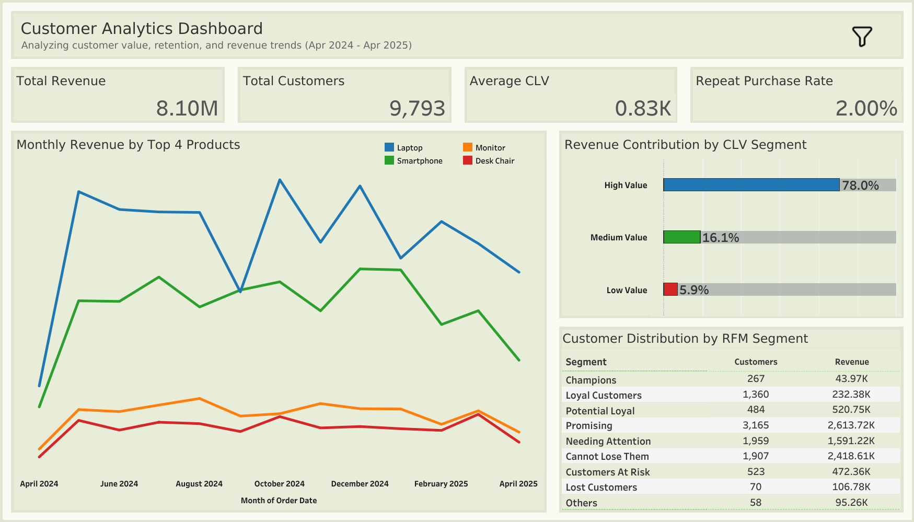

# Customer Analytics: CLV, RFM Segmentation & Retention Analysis
## Project Overview
This project is an end-to-end customer analytics project that analyzes customer behavior using RFM segmentation, Customer Lifetime Value (CLV), and retention analysis.

The goal of this project is to help businesses identify high-value customers, understand customer retention, and analyze revenue contribution by different customer segments.

This project covers the complete data analysis pipeline including data cleaning, exploratory data analysis, SQL-based analytics, customer segmentation, and dashboard visualization.

---

## Business Problem
Businesses often struggle to answer important questions such as:
 - Who are the most valuable customers?
 - Which customers are at risk of leaving?
 - How much revenue comes from loyal customers?
 - What is the customer retention rate?
 - How can the business improve customer retention?

This project solves these problems using customer data analysis and segmentation techniques.

---

## Project Workflow
Raw Data → Data Cleaning (Python) → Exploratory Data Analysis → Data Analysis (SQL) → RFM Segmentation → CLV Calculation → Retention Analysis → Tableau Dashboard → Business Insights

---

## Tools & Technologies
- **Python** - Data Cleaning and EDA
- **MySQL** – Data Analysis, RFM Segmentation, CLV Calculation, Retention Analysis
- **Tableau** – Data Visualization

---

## Project Structure
```
CLV-Retention-Analysis/
│
├── data/
│   ├── raw_ecommerce_data.csv
│   └── cleaned_ecommerce_data.csv
│
├── python/
│   ├── 01_data_cleaning.py
│   └── 02_eda_analysis.py
│
├── sql/
│   ├── 01_database_schema.sql
│   ├── 02_customer_metrics.sql
│   ├── 03_rfm_segmentation.sql
│   ├── 04_clv_calculation.sql
│   └── 05_retention_analysis.sql
│
├── tableau/
│   ├── Customer Analytics Dashboard.twb
│   └── dashboard_img.png
|
└── README.md
```

---

## Key Analysis Performed
- Data Cleaning and Preprocessing using Python
- Exploratory Data Analysis (EDA)
- Customer Revenue Analysis
- RFM Segmentation (Recency, Frequency, Monetary)
- Customer Lifetime Value (CLV) Calculation
- Repeat Purchase Rate Calculation
- Customer Retention Analysis
- Revenue Contribution by Customer Segment

---

## Dashboard Preview


---

## Key Insights
 - High value customers contribute the majority of total revenue.
 - Most customers fall under Promising and Need Attention segments.
 - Repeat purchase rate is low, indicates an oppurtunity to improve retention.
 - Loyal customers generate a significant portion of revenue.
 - Some customers are at risk of churning and need targeted marketing strategies

---

## Business Recommendations
 - Provide loyalty rewards and exclusive offers to high-value customers.
 - Target customers at risk with personalized offers and discounts.
 - Convert promising customers into loyal customers through marketing campaigns.
 - Improve customer retention strategies to increase repeat purchase rate.
 - Focus on customer engagement to reduce churn.

---

## How to Run This Project
1. Download the dataset from the data folder.
2. Run Python scripts:
   - 01_data_cleaning.py
   - 02_eda_analysis.py
3. Run SQL scripts in order:
   - 01_database_schema.sql
   - 02_customer_metrics.sql
   - 03_rfm_segmentation.sql
   - 04_clv_calculation.sql
   - 05_retention_analysis.sql
4. Open the Tableau file:
   - Customer Analytics Dashboard.twb

---

## Project Outcome
This project provides insights into customer behavior and helps businesses:
- Identify high-value customers
- Improve customer retention
- Understand revenue contribution by customer segments
- Make data-driven marketing and business decisions

---

## Author
**Naina Sonkar**
Data Analyst
Skills: Excel, SQL, Python, Tableau, Data Analysis, Data Visualization
Github: https://github.com/naina250
